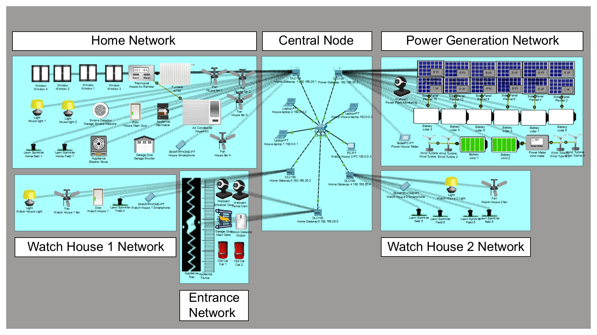
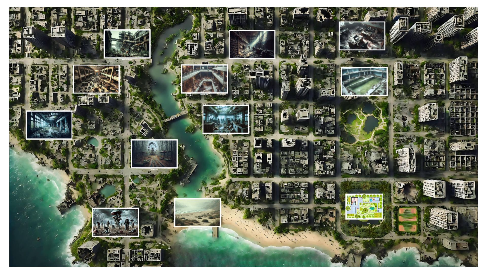

# Silicon-Apocalypse-iot


[](License.txt)
[](https://www.netacad.com/courses/packet-tracer)
[](docs/published-paper.pdf)

> **IoT-Based Disaster Resilience Simulation** > *A smart grid and bio-secure perimeter simulation designed for extreme disaster scenarios.*

---

## 📄 Abstract
**Silicon Apocalypse** is a network engineering research project that models a self-sufficient, automated smart home environment capable of sustaining life during high-risk disaster scenarios.

Published in the **Mukt Shabd Journal (April 2025)**, this project demonstrates the application of **IoT protocols**, **renewable energy management**, and **automated security logic** using Cisco Packet Tracer's MCU capabilities. The system is designed to operate off-grid, managing resource consumption and perimeter defense without human intervention.

---

## 🚀 Key Features

### 1. Smart Energy Grid (Off-Grid Capability)
* **Solar Array Management:** Integrated solar panels with battery storage to ensure 24/7 power availability independent of the main grid.
* **IoT Power Monitoring:** Real-time energy consumption tracking via a centralized smartphone dashboard.

### 2. Autonomous Perimeter Defense
* **"Code Red" Logic:** The system uses conditional logic to detect threats.
    * *Input:* Motion Sensors (Perimeter)
    * *Output:* Activating Electrified Fences, Locking Main Gates, and Triggering Sirens.
* **Surveillance Network:** A star-topology network of webcams monitoring key ingress points (Entrance, Garage, Fence).

### 3. Resilient Network Architecture
* **Topology:** Star Topology centered around a Home Gateway and Central Switch to minimize latency.
* **Connectivity:** Devices operate on a **2.4 GHz Wi-Fi** standard (WPA2-PSK) to ensure secure, wireless command propagation across the facility.

---

## 🛠️ Technical Implementation

The simulation relies on Cisco Packet Tracer's **IoT Registration Server** and **MCU/SBC Programming**.

| Device Type | Function | Connectivity |
| :--- | :--- | :--- |
| **Home Gateway** | Central IoT Server & DHCP | Ethernet/Wi-Fi |
| **MCU (Microcontroller)** | Runs Python/Blockly automation scripts | IoT Custom Cable |
| **Motion Sensors** | Triggers "Code Red" state | Digital Input |
| **Actuators** | Sirens, Door Locks, Electric Fence | Digital Output |

### Automation Logic Example
The core security algorithm operates on a simple state machine:

| State | Trigger | System Response |
| :--- | :--- | :--- |
| **SAFE** | `Motion == False` | Unlock Gates, Disarm Traps, Power Down High-Energy Cams |
| **THREAT** | `Motion == True` | **Lock All Gates**, **Electrify Fence**, **Arm Traps**, **Alert Admin** |

---

## 📸 Simulation Visuals

| Logical Topology | Physical City Map |
| :---: | :---: |
|  |  |
| *Fig 1: Network Logical View* | *Fig 2: Infection Map Simulation* |

---

## 📜 Certifications & Research

This project is backed by published academic research and technical certification.

* **Research Paper:** [📄 Read "Silicon Apocalypse Using Cisco Packet Tracer"](docs/published-paper.pdf)  
    *Published in Mukt Shabd Journal, Volume XIV, Issue IV, April 2025.*
* **Technical Qualification:** [📜 View Cisco Packet Tracer Certificate](docs/cisco-certificate.pdf)

---

## 💻 How to Run

1.  **Prerequisites:** Install **Cisco Packet Tracer** (Version 7.0 or higher required for IoT support).
2.  **Download:** Clone this repository.
    ```bash
    git clone [https://github.com/gowtham2thrive/Silicon-Apocalypse-iot.git](https://github.com/gowtham2thrive/Silicon-Apocalypse-iot.git)
    ```
    > **Note:** The source file (`src/silicon_apocalypse_simulation.pkt`) is approx **97 MB**. Ensure you have a stable connection when cloning.
3.  **Launch:** Open the `.pkt` file in Cisco Packet Tracer.
4.  **Interact:**
    * Click on the **Smartphone** device in the workspace.
    * Open the **IoT Monitor** app to view the dashboard.
    * **Simulate a Threat:** Hold `Alt` and click a Motion Sensor to trigger the "Code Red" security protocol.

---

## ⚠️ Disclaimer
This project simulation was designed using **Cisco Packet Tracer**. The `.pkt` source file is provided strictly for educational and portfolio demonstration purposes. This software and its associated file formats (`.pkt`) are subject to Cisco Systems' End User License Agreement. Users must possess a valid Cisco Networking Academy account or appropriate license to execute the simulation.

---

<details>
<summary><b>🛰️ SATELLITE FEED: Disaster Sectors (Click to Expand)</b></summary>

### ⚠️ Sector A: Critical Infrastructure
*Status: Compromised / High Strategic Value*

| **Security Precinct** | **Industrial Plant** | **Education Facility** |
| :---: | :---: | :---: |
|  |  |  |
| *Status: OVERRUN* | *Status: HIGH VOLTAGE* | *Status: EVACUATED* |

### ☣️ Sector B: Biological Hazard Zones
*Status: Avoid Contact / Toxic Spores Detected*

| **Bio-Contamination** | **Stagnant Reservoir** | **Recreation Park** |
| :---: | :---: | :---: |
|  |  |  |
| *Threat: SPORE CLOUDS* | *Threat: WATERBORNE VIRUS* | *Threat: EXTREME* |

### 🏢 Sector C: Commercial & Logistics
*Status: Looted / Structural Instability*

| **Commercial Complex** | **Supply Depot** | **Corporate Admin** |
| :---: | :---: | :---: |
|  |  |  |
| *Signal: INTERMITTENT* | *Status: SCAVENGED* | *Signal: LOST* |

### 🌊 Sector D: Perimeter & Archives

| **Coastal Breach** | **Municipal Archives** |
| :---: | :---: |
|  |  |
| *Status: PERIMETER FAILED* | *Status: RECORDS INTACT* |

</details>

---

## 🎓 Acknowledgments

I extend my sincere gratitude to my mentors for their invaluable guidance and support throughout this research:

* **S. Phani Varaprasad** (Head of Department, ECE)
* **B. Padmavathi** (Head of Department, CME)
* **S. Hemalatha** (Class Coordinator)
